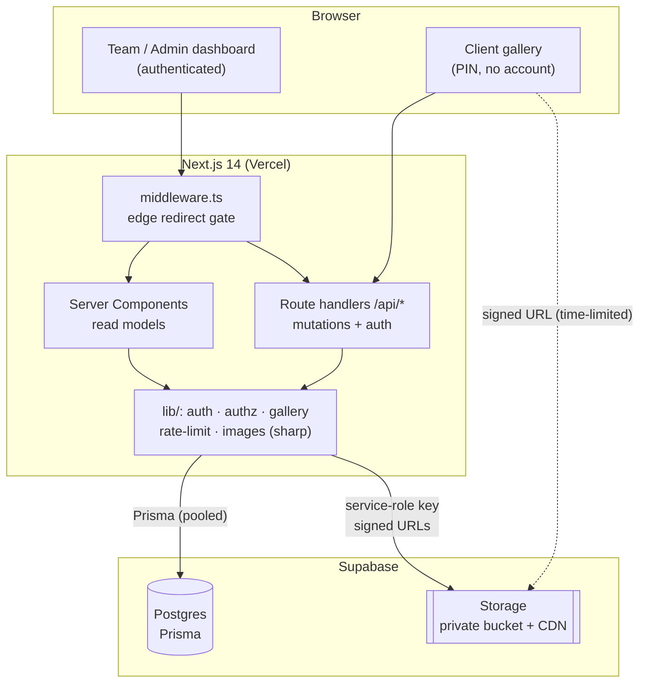
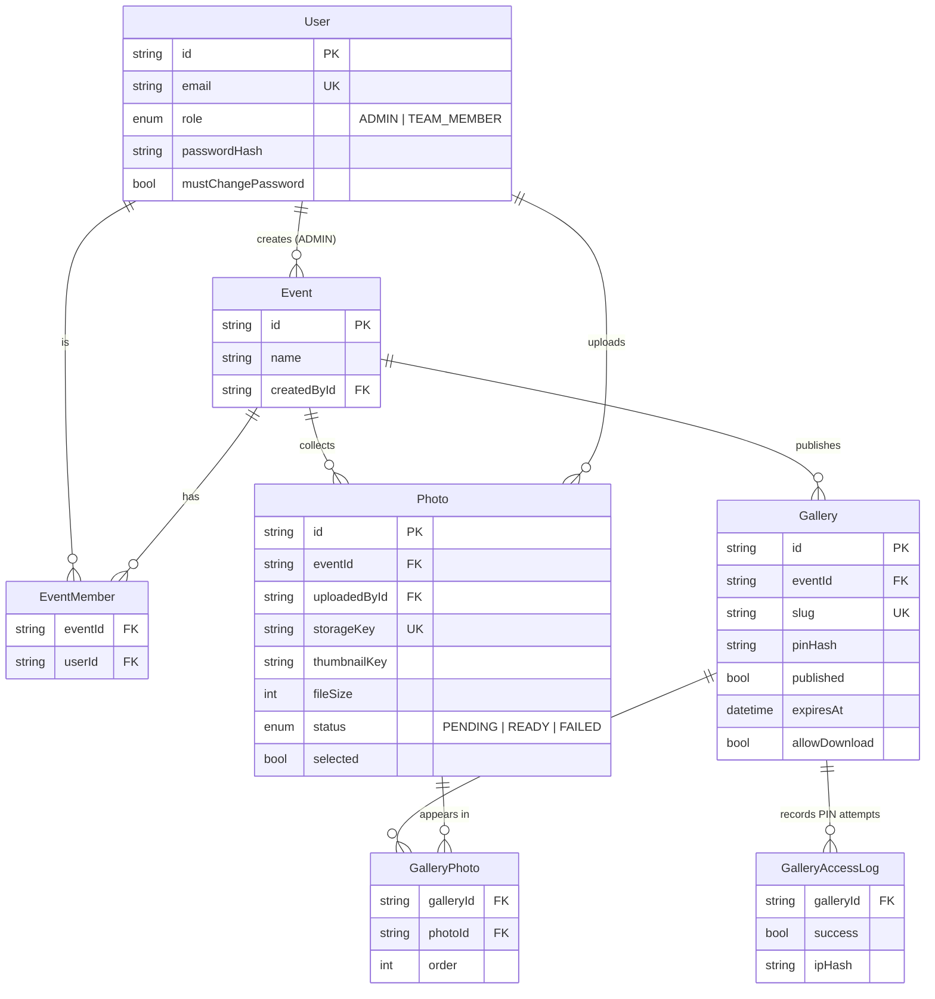
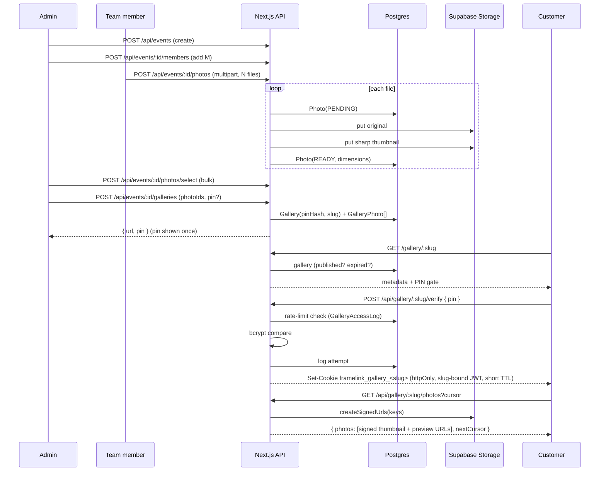

# FrameLink — Architecture

## 1. High-level components

## 2. Entity relationships

## 3. Publish + customer-access sequence

## 4. Authorization decision points

| Guard (`src/lib/authz.ts`) | Used by | Rule |
|---|---|---|
| `assertEventAccess(user, eventId)` | every event / photo / gallery route | ADMIN → any event; TEAM_MEMBER → only via `EventMember`; otherwise **404** (existence hidden) |
| `assertAdmin(user)` | member add/remove, photo select, all gallery writes | non-admin → **403** |
| `assertPhotoManage(user, photoId)` | `DELETE /api/photos/:id` | uploader or ADMIN only |
| `requireGalleryAccess(slug)` (`gallery-session.ts`) | `/api/gallery/:slug/photos`, `/download/*` | valid slug-scoped JWT cookie required |
| `assertGalleryViewable(gallery)` (`gallery.ts`) | all public gallery routes | must be `published` and not past `expiresAt` |

## 5. Why the design scales

- **Cursor pagination** everywhere photos are listed — no `OFFSET` scans at 1,000+ photos.
- **Composite indexes** `[eventId, selected]` and `[eventId, status]` make the admin's "selected only" / "ready only" filters index-only.
- **Selection is a boolean on `Photo`**; publishing **snapshots** into `GalleryPhoto`, so re-curating a future gallery never disturbs a live one.
- **Storage is addressed by key**, never listed — all reads are point lookups turned into signed URLs.
- Stateless JWT sessions → the app layer is horizontally scalable with no shared session store.
- The one piece of mutable shared state (PIN rate limiting) is a bounded, indexed table today and can move to Redis without touching callers.
